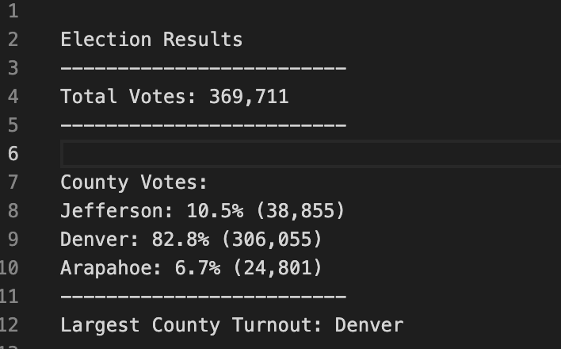
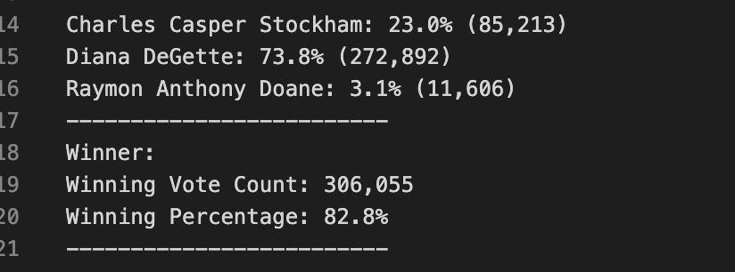

# Analysis of the Election Audit
## Overview of Election Audit
The purpose of this election analysis was to audit the tabulated results for a U.S. congressional precinct in Colorado. The analysis was done using Python and hopes to be a future model for other congressional districts, senatorial districts, and local elections.
## Election Audit Results
* There were 369,711 total votes cast in this congressional election.
* Jefferson County received 10.5% of the total votes with 38,855 total votes. Denver county received 82.8% of total votes with 306,055 total votes. Arapahoe county received 6.7% of total votes with 24,801 total votes. 
        
* Denver county received the largest number of total votes with 306,055 votes of the 369,711 total votes.
* Charles Casper Stockham received 23.0% of the total votes with 85,213 votes. Diana DeGette received 73.8% of the total votes with 272,892 votes. Raymon Anthony Doane received 3.1% of the total votes with 11,606 votes. 
        
* Dianna DeGette won the election with 272,892 total votes and 73.8% of the total votes.  
## Election Audit Summary
The success of this script in this congressional precinct election is just the beginning of what it can be used for in other elections across the country. This election analysis script can be used as a model for future elections such as senatorial districts and more. The script could easily be modified to not only include county results, but statewide results as well such as for State Senator. A simple addition to the csv file including the state and adding code to account for this would make this possible. This script could also be modified to find results for voter turnout by party. Political parties would be very interested in knowing the turnout per county of their voters, so they know better which counties to target in future elections. 
